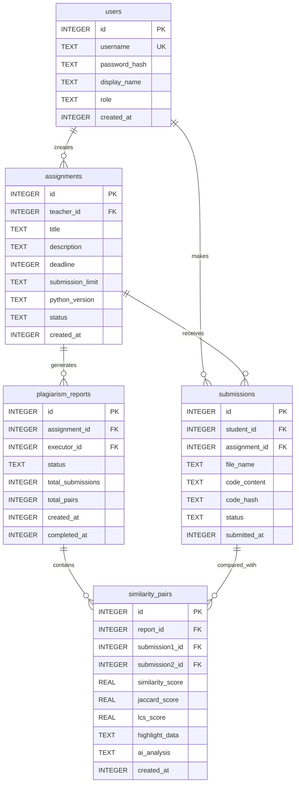

# Data Model Design: CodeChecker Android应用

**Date**: 2025-11-27
**Feature**: CodeChecker Android应用 - Python代码查重助手
**Output of**: Phase 1 - Design & Contracts

## 实体关系图 (ER Diagram)



## 数据实体详细设计

### 1. 用户实体 (User)

**领域模型**:
```kotlin
data class User(
    val id: Long = 0,
    val username: String,
    val passwordHash: String,
    val displayName: String,
    val role: UserRole,
    val createdAt: Long
)

enum class UserRole(val displayName: String) {
    STUDENT("学生"),
    TEACHER("教师");

    companion object {
        fun fromString(role: String): UserRole {
            return when(role.uppercase()) {
                "STUDENT" -> STUDENT
                "TEACHER" -> TEACHER
                else -> throw IllegalArgumentException("Unknown role: $role")
            }
        }
    }
}
```

**数据库实体**:
```kotlin
@Entity(
    tableName = "users",
    indices = [
        Index(value = ["username"], unique = true),
        Index(value = ["role"])
    ]
)
data class UserEntity(
    @PrimaryKey(autoGenerate = true) val id: Long = 0,
    @ColumnInfo(name = "username") val username: String,
    @ColumnInfo(name = "password_hash") val passwordHash: String,
    @ColumnInfo(name = "display_name") val displayName: String,
    @ColumnInfo(name = "role") val role: String,
    @ColumnInfo(name = "created_at") val createdAt: Long
) {
    fun toDomain(): User {
        return User(
            id = id,
            username = username,
            passwordHash = passwordHash,
            displayName = displayName,
            role = UserRole.fromString(role),
            createdAt = createdAt
        )
    }

    companion object {
        fun fromDomain(user: User): UserEntity {
            return UserEntity(
                id = user.id,
                username = user.username,
                passwordHash = user.passwordHash,
                displayName = user.displayName,
                role = user.role.name,
                createdAt = user.createdAt
            )
        }
    }
}
```

**验证规则**:
- username: 长度4-20字符，仅允许字母数字和下划线，必须全局唯一
- passwordHash: SHA-256加密后长度64字符
- displayName: 长度2-10字符，不能为空
- role: 只能是STUDENT或TEACHER
- createdAt: Unix时间戳，不能为空

---

### 2. 作业实体 (Assignment)

**领域模型**:
```kotlin
data class Assignment(
    val id: Long = 0,
    val teacherId: Long,
    val title: String,
    val description: String = "",
    val deadline: Long? = null,
    val submissionLimit: SubmissionLimit,
    val pythonVersion: PythonVersion,
    val status: AssignmentStatus,
    val createdAt: Long
) {
    fun isActive(): Boolean = status == AssignmentStatus.ACTIVE
    fun isClosed(): Boolean = status == AssignmentStatus.CLOSED
    fun isDraft(): Boolean = status == AssignmentStatus.DRAFT
    fun isDeadlinePassed(): Boolean = deadline?.let { it < System.currentTimeMillis() } ?: false
}

enum class SubmissionLimit(val displayName: String, val maxSubmissions: Int) {
    SMALL("小型作业(≤200份)", 200),
    LARGE("大型作业(≤500份)", 500),
    UNLIMITED("无限制作业", Int.MAX_VALUE);

    fun allowsSubmission(currentCount: Int): Boolean {
        return currentCount < maxSubmissions
    }
}

enum class PythonVersion(val displayName: String, val supportsPython2: Boolean, val supportsPython3: Boolean) {
    PYTHON2("Python 2.x", true, false),
    PYTHON3("Python 3.x", false, true),
    BOTH("Python 2.x/3.x兼容", true, true);

    companion object {
        fun fromString(version: String): PythonVersion {
            return when(version.uppercase()) {
                "PYTHON2" -> PYTHON2
                "PYTHON3" -> PYTHON3
                "BOTH" -> BOTH
                else -> throw IllegalArgumentException("Unknown version: $version")
            }
        }
    }
}

enum class AssignmentStatus(val displayName: String) {
    DRAFT("草稿"),
    ACTIVE("进行中"),
    CLOSED("已截止");

    companion object {
        fun fromString(status: String): AssignmentStatus {
            return when(status.uppercase()) {
                "DRAFT" -> DRAFT
                "ACTIVE" -> ACTIVE
                "CLOSED" -> CLOSED
                else -> throw IllegalArgumentException("Unknown status: $status")
            }
        }
    }
}
```

**数据库实体**:
```kotlin
@Entity(
    tableName = "assignments",
    foreignKeys = [
        ForeignKey(
            entity = UserEntity::class,
            parentColumns = ["id"],
            childColumns = ["teacher_id"],
            onDelete = ForeignKey.CASCADE
        )
    ],
    indices = [
        Index(value = ["teacher_id"]),
        Index(value = ["status"]),
        Index(value = ["deadline"])
    ]
)
data class AssignmentEntity(
    @PrimaryKey(autoGenerate = true) val id: Long = 0,
    @ColumnInfo(name = "teacher_id") val teacherId: Long,
    @ColumnInfo(name = "title") val title: String,
    @ColumnInfo(name = "description") val description: String,
    @ColumnInfo(name = "deadline") val deadline: Long?,
    @ColumnInfo(name = "submission_limit") val submissionLimit: String,
    @ColumnInfo(name = "python_version") val pythonVersion: String,
    @ColumnInfo(name = "status") val status: String,
    @ColumnInfo(name = "created_at") val createdAt: Long
) {
    fun toDomain(): Assignment {
        return Assignment(
            id = id,
            teacherId = teacherId,
            title = title,
            description = description,
            deadline = deadline,
            submissionLimit = SubmissionLimit.fromString(submissionLimit),
            pythonVersion = PythonVersion.fromString(pythonVersion),
            status = AssignmentStatus.fromString(status),
            createdAt = createdAt
        )
    }

    companion object {
        fun fromDomain(assignment: Assignment): AssignmentEntity {
            return AssignmentEntity(
                id = assignment.id,
                teacherId = assignment.teacherId,
                title = assignment.title,
                description = assignment.description,
                deadline = assignment.deadline,
                submissionLimit = assignment.submissionLimit.name,
                pythonVersion = assignment.pythonVersion.name,
                status = assignment.status.name,
                createdAt = assignment.createdAt
            )
        }
    }
}
```

**验证规则**:
- title: 长度1-100字符，必填
- description: 最大长度1000字符，可选
- deadline: 可选，Unix时间戳
- submissionLimit: 只能是SMALL/LARGE/UNLIMITED
- pythonVersion: 只能是PYTHON2/PYTHON3/BOTH
- status: 只能是DRAFT/ACTIVE/CLOSED

---

### 3. 提交实体 (Submission)

**领域模型**:
```kotlin
data class Submission(
    val id: Long = 0,
    val studentId: Long,
    val assignmentId: Long,
    val fileName: String,
    val codeContent: String,
    val codeHash: String,
    val status: SubmissionStatus,
    val submittedAt: Long
) {
    fun getFileExtension(): String {
        return fileName.substringAfterLast('.', "")
    }

    fun isValidPythonFile(): Boolean {
        val ext = getFileExtension().lowercase()
        return ext == "py"
    }
}

enum class SubmissionStatus(val displayName: String) {
    SUBMITTED("已提交"),
    CHECKED("已查重"),
    ANALYZED("已分析");

    companion object {
        fun fromString(status: String): SubmissionStatus {
            return when(status.uppercase()) {
                "SUBMITTED" -> SUBMITTED
                "CHECKED" -> CHECKED
                "ANALYZED" -> ANALYZED
                else -> throw IllegalArgumentException("Unknown status: $status")
            }
        }
    }
}
```

**数据库实体**:
```kotlin
@Entity(
    tableName = "submissions",
    foreignKeys = [
        ForeignKey(
            entity = UserEntity::class,
            parentColumns = ["id"],
            childColumns = ["student_id"],
            onDelete = ForeignKey.CASCADE
        ),
        ForeignKey(
            entity = AssignmentEntity::class,
            parentColumns = ["id"],
            childColumns = ["assignment_id"],
            onDelete = ForeignKey.CASCADE
        )
    ],
    indices = [
        Index(value = ["student_id"]),
        Index(value = ["assignment_id"]),
        Index(value = ["status"]),
        Index(value = ["submitted_at"]),
        Index(value = ["code_hash"])
    ]
)
data class SubmissionEntity(
    @PrimaryKey(autoGenerate = true) val id: Long = 0,
    @ColumnInfo(name = "student_id") val studentId: Long,
    @ColumnInfo(name = "assignment_id") val assignmentId: Long,
    @ColumnInfo(name = "file_name") val fileName: String,
    @ColumnInfo(name = "code_content") val codeContent: String,
    @ColumnInfo(name = "code_hash") val codeHash: String,
    @ColumnInfo(name = "status") val status: String,
    @ColumnInfo(name = "submitted_at") val submittedAt: Long
) {
    fun toDomain(): Submission {
        return Submission(
            id = id,
            studentId = studentId,
            assignmentId = assignmentId,
            fileName = fileName,
            codeContent = codeContent,
            codeHash = codeHash,
            status = SubmissionStatus.fromString(status),
            submittedAt = submittedAt
        )
    }

    companion object {
        fun fromDomain(submission: Submission): SubmissionEntity {
            return SubmissionEntity(
                id = submission.id,
                studentId = submission.studentId,
                assignmentId = submission.assignmentId,
                fileName = submission.fileName,
                codeContent = submission.codeContent,
                codeHash = submission.codeHash,
                status = submission.status.name,
                submittedAt = submission.submittedAt
            )
        }
    }
}
```

**验证规则**:
- fileName: 长度1-255字符，扩展名必须是.py
- codeContent: 不能为空，最大1MB
- codeHash: MD5哈希值，32字符
- status: 只能是SUBMITTED/CHECKED/ANALYZED
- submittedAt: Unix时间戳，不能为空

---

### 4. 查重报告实体 (Report)

**领域模型**:
```kotlin
data class Report(
    val id: Long = 0,
    val assignmentId: Long,
    val executorId: Long,
    val status: ReportStatus,
    val totalSubmissions: Int,
    val totalPairs: Int,
    val createdAt: Long,
    val completedAt: Long? = null
) {
    fun getProgress(): Float {
        return if (totalPairs == 0) 0f else {
            val completedPairs = when(status) {
                ReportStatus.PENDING -> 0
                ReportStatus.COMPLETED -> totalPairs
                ReportStatus.FAILED -> totalPairs
            }
            (completedPairs.toFloat() / totalPairs) * 100
        }
    }

    fun isCompleted(): Boolean = status == ReportStatus.COMPLETED
    fun isInProgress(): Boolean = status == ReportStatus.PENDING
    fun isFailed(): Boolean = status == ReportStatus.FAILED
}

enum class ReportStatus(val displayName: String) {
    PENDING("进行中"),
    COMPLETED("已完成"),
    FAILED("失败");

    companion object {
        fun fromString(status: String): ReportStatus {
            return when(status.uppercase()) {
                "PENDING" -> PENDING
                "COMPLETED" -> COMPLETED
                "FAILED" -> FAILED
                else -> throw IllegalArgumentException("Unknown status: $status")
            }
        }
    }
}
```

**数据库实体**:
```kotlin
@Entity(
    tableName = "plagiarism_reports",
    foreignKeys = [
        ForeignKey(
            entity = AssignmentEntity::class,
            parentColumns = ["id"],
            childColumns = ["assignment_id"],
            onDelete = ForeignKey.CASCADE
        ),
        ForeignKey(
            entity = UserEntity::class,
            parentColumns = ["id"],
            childColumns = ["executor_id"],
            onDelete = ForeignKey.CASCADE
        )
    ],
    indices = [
        Index(value = ["assignment_id"]),
        Index(value = ["executor_id"]),
        Index(value = ["status"]),
        Index(value = ["created_at"])
    ]
)
data class ReportEntity(
    @PrimaryKey(autoGenerate = true) val id: Long = 0,
    @ColumnInfo(name = "assignment_id") val assignmentId: Long,
    @ColumnInfo(name = "executor_id") val executorId: Long,
    @ColumnInfo(name = "status") val status: String,
    @ColumnInfo(name = "total_submissions") val totalSubmissions: Int,
    @ColumnInfo(name = "total_pairs") val totalPairs: Int,
    @ColumnInfo(name = "created_at") val createdAt: Long,
    @ColumnInfo(name = "completed_at") val completedAt: Long?
) {
    fun toDomain(): Report {
        return Report(
            id = id,
            assignmentId = assignmentId,
            executorId = executorId,
            status = ReportStatus.fromString(status),
            totalSubmissions = totalSubmissions,
            totalPairs = totalPairs,
            createdAt = createdAt,
            completedAt = completedAt
        )
    }

    companion object {
        fun fromDomain(report: Report): ReportEntity {
            return ReportEntity(
                id = report.id,
                assignmentId = report.assignmentId,
                executorId = report.executorId,
                status = report.status.name,
                totalSubmissions = report.totalSubmissions,
                totalPairs = report.totalPairs,
                createdAt = report.createdAt,
                completedAt = report.completedAt
            )
        }
    }
}
```

**验证规则**:
- status: 只能是PENDING/COMPLETED/FAILED
- totalSubmissions: >0，不能为空
- totalPairs: >0，计算得出
- completedAt: 仅在COMPLETED状态时非空

---

### 5. 相似度记录实体 (Similarity)

**领域模型**:
```kotlin
data class Similarity(
    val id: Long = 0,
    val reportId: Long,
    val submission1Id: Long,
    val submission2Id: Long,
    val similarityScore: Float,
    val jaccardScore: Float,
    val lcsScore: Float,
    val highlightData: HighlightData,
    val aiAnalysis: String? = null,
    val createdAt: Long
) {
    fun isHighSimilarity(): Boolean = similarityScore >= 60f
    fun isMediumSimilarity(): Boolean = similarityScore in 40f..59.9f
    fun isLowSimilarity(): Boolean = similarityScore < 40f

    fun getRiskLevel(): String {
        return when {
            similarityScore >= 80f -> "高"
            similarityScore >= 60f -> "中"
            else -> "低"
        }
    }
}

data class HighlightData(
    val matches: List<MatchRegion>
)

data class MatchRegion(
    val submission1Line: Int,
    val submission2Line: Int,
    val length: Int
)
```

**数据库实体**:
```kotlin
@Entity(
    tableName = "similarity_pairs",
    foreignKeys = [
        ForeignKey(
            entity = ReportEntity::class,
            parentColumns = ["id"],
            childColumns = ["report_id"],
            onDelete = ForeignKey.CASCADE
        ),
        ForeignKey(
            entity = SubmissionEntity::class,
            parentColumns = ["id"],
            childColumns = ["submission1_id"],
            onDelete = ForeignKey.CASCADE
        ),
        ForeignKey(
            entity = SubmissionEntity::class,
            parentColumns = ["id"],
            childColumns = ["submission2_id"],
            onDelete = ForeignKey.CASCADE
        )
    ],
    indices = [
        Index(value = ["report_id"]),
        Index(value = ["submission1_id"]),
        Index(value = ["submission2_id"]),
        Index(value = ["similarity_score"]),
        Index(
            value = ["report_id", "similarity_score"],
            orders = [Index.Order.DESC]
        )
    ]
)
data class SimilarityEntity(
    @PrimaryKey(autoGenerate = true) val id: Long = 0,
    @ColumnInfo(name = "report_id") val reportId: Long,
    @ColumnInfo(name = "submission1_id") val submission1Id: Long,
    @ColumnInfo(name = "submission2_id") val submission2Id: Long,
    @ColumnInfo(name = "similarity_score") val similarityScore: Float,
    @ColumnInfo(name = "jaccard_score") val jaccardScore: Float,
    @ColumnInfo(name = "lcs_score") val lcsScore: Float,
    @ColumnInfo(name = "highlight_data") val highlightData: String, // JSON
    @ColumnInfo(name = "ai_analysis") val aiAnalysis: String?,
    @ColumnInfo(name = "created_at") val createdAt: Long
) {
    fun toDomain(): Similarity {
        val json = Json { ignoreUnknownKeys = true }
        val highlight = try {
            json.decodeFromString<HighlightData>(highlightData)
        } catch (e: Exception) {
            HighlightData(emptyList())
        }

        return Similarity(
            id = id,
            reportId = reportId,
            submission1Id = submission1Id,
            submission2Id = submission2Id,
            similarityScore = similarityScore,
            jaccardScore = jaccardScore,
            lcsScore = lcsScore,
            highlightData = highlight,
            aiAnalysis = aiAnalysis,
            createdAt = createdAt
        )
    }

    companion object {
        fun fromDomain(similarity: Similarity): SimilarityEntity {
            val json = Json { ignoreUnknownKeys = true }
            val highlightJson = json.encodeToString(similarity.highlightData)

            return SimilarityEntity(
                id = similarity.id,
                reportId = similarity.reportId,
                submission1Id = similarity.submission1Id,
                submission2Id = similarity.submission2Id,
                similarityScore = similarity.similarityScore,
                jaccardScore = similarity.jaccardScore,
                lcsScore = similarity.lcsScore,
                highlightData = highlightJson,
                aiAnalysis = similarity.aiAnalysis,
                createdAt = similarity.createdAt
            )
        }
    }
}
```

**验证规则**:
- similarityScore: 0.0-100.0之间的浮点数
- jaccardScore: 0.0-100.0之间的浮点数
- lcsScore: 0.0-100.0之间的浮点数
- highlightData: JSON格式字符串
- aiAnalysis: 可选，JSON或文本格式
- submission1Id ≠ submission2Id

---

## DAO接口设计

### 1. UserDao

```kotlin
@Dao
interface UserDao {

    @Query("SELECT * FROM users WHERE id = :id")
    suspend fun getUserById(id: Long): UserEntity?

    @Query("SELECT * FROM users WHERE username = :username")
    suspend fun getUserByUsername(username: String): UserEntity?

    @Query("SELECT * FROM users")
    suspend fun getAllUsers(): List<UserEntity>

    @Insert(onConflict = OnConflictStrategy.ABORT)
    suspend fun insertUser(user: UserEntity): Long

    @Update
    suspend fun updateUser(user: UserEntity)

    @Delete
    suspend fun deleteUser(user: UserEntity)

    @Query("DELETE FROM users WHERE id = :id")
    suspend fun deleteUserById(id: Long)
}
```

### 2. AssignmentDao

```kotlin
@Dao
interface AssignmentDao {

    @Query("SELECT * FROM assignments WHERE teacher_id = :teacherId ORDER BY created_at DESC")
    suspend fun getAssignmentsByTeacher(teacherId: Long): List<AssignmentEntity>

    @Query("SELECT * FROM assignments WHERE id = :id")
    suspend fun getAssignmentById(id: Long): AssignmentEntity?

    @Query("SELECT * FROM assignments WHERE status = :status")
    suspend fun getAssignmentsByStatus(status: String): List<AssignmentEntity>

    @Insert(onConflict = OnConflictStrategy.REPLACE)
    suspend fun insertAssignment(assignment: AssignmentEntity): Long

    @Update
    suspend fun updateAssignment(assignment: AssignmentEntity)

    @Delete
    suspend fun deleteAssignment(assignment: AssignmentEntity)

    @Query("SELECT COUNT(*) FROM submissions WHERE assignment_id = :assignmentId")
    suspend fun getSubmissionCount(assignmentId: Long): Int
}
```

### 3. SubmissionDao

```kotlin
@Dao
interface SubmissionDao {

    @Query("SELECT * FROM submissions WHERE assignment_id = :assignmentId ORDER BY submitted_at DESC")
    suspend fun getSubmissionsByAssignment(assignmentId: Long): List<SubmissionEntity>

    @Query("SELECT * FROM submissions WHERE student_id = :studentId ORDER BY submitted_at DESC")
    suspend fun getSubmissionsByStudent(studentId: Long): List<SubmissionEntity>

    @Query("SELECT * FROM submissions WHERE assignment_id = :assignmentId AND student_id = :studentId ORDER BY submitted_at DESC")
    suspend fun getSubmissionsByAssignmentAndStudent(
        assignmentId: Long,
        studentId: Long
    ): List<SubmissionEntity>

    @Query("SELECT * FROM submissions WHERE id = :id")
    suspend fun getSubmissionById(id: Long): SubmissionEntity?

    @Insert(onConflict = OnConflictStrategy.REPLACE)
    suspend fun insertSubmission(submission: SubmissionEntity): Long

    @Update
    suspend fun updateSubmission(submission: SubmissionEntity)

    @Delete
    suspend fun deleteSubmission(submission: SubmissionEntity)

    @Query("SELECT * FROM submissions WHERE code_hash = :hash LIMIT 1")
    suspend fun getSubmissionByHash(hash: String): SubmissionEntity?
}
```

### 4. ReportDao

```kotlin
@Dao
interface ReportDao {

    @Query("SELECT * FROM plagiarism_reports WHERE assignment_id = :assignmentId ORDER BY created_at DESC")
    suspend fun getReportsByAssignment(assignmentId: Long): List<ReportEntity>

    @Query("SELECT * FROM plagiarism_reports WHERE executor_id = :executorId ORDER BY created_at DESC")
    suspend fun getReportsByExecutor(executorId: Long): List<ReportEntity>

    @Query("SELECT * FROM plagiarism_reports WHERE id = :id")
    suspend fun getReportById(id: Long): ReportEntity?

    @Query("SELECT * FROM plagiarism_reports WHERE status = 'PENDING'")
    suspend fun getPendingReports(): List<ReportEntity>

    @Insert(onConflict = OnConflictStrategy.REPLACE)
    suspend fun insertReport(report: ReportEntity): Long

    @Update
    suspend fun updateReport(report: ReportEntity)

    @Delete
    suspend fun deleteReport(report: ReportEntity)
}
```

### 5. SimilarityDao

```kotlin
@Dao
interface SimilarityDao {

    @Query("SELECT * FROM similarity_pairs WHERE report_id = :reportId ORDER BY similarity_score DESC")
    suspend fun getSimilaritiesByReport(reportId: Long): List<SimilarityEntity>

    @Query("SELECT * FROM similarity_pairs WHERE report_id = :reportId AND similarity_score >= :threshold ORDER BY similarity_score DESC")
    suspend fun getHighSimilarities(
        reportId: Long,
        threshold: Float = 60f
    ): List<SimilarityEntity>

    @Query("SELECT * FROM similarity_pairs WHERE submission1_id = :submissionId OR submission2_id = :submissionId")
    suspend fun getSimilaritiesBySubmission(submissionId: Long): List<SimilarityEntity>

    @Query("SELECT * FROM similarity_pairs WHERE id = :id")
    suspend fun getSimilarityById(id: Long): SimilarityEntity?

    @Insert(onConflict = OnConflictStrategy.REPLACE)
    suspend fun insertSimilarity(similarity: SimilarityEntity): Long

    @Insert(onConflict = OnConflictStrategy.REPLACE)
    suspend fun insertSimilarities(similarities: List<SimilarityEntity>)

    @Update
    suspend fun updateSimilarity(similarity: SimilarityEntity)

    @Delete
    suspend fun deleteSimilarity(similarity: SimilarityEntity)

    @Query("DELETE FROM similarity_pairs WHERE report_id = :reportId")
    suspend fun deleteSimilaritiesByReport(reportId: Long)
}
```

---

## 数据迁移策略

### 版本1: 初始数据库

```kotlin
val MIGRATION_1_2 = object : Migration(1, 2) {
    override fun migrate(database: SupportSQLiteDatabase) {
        // 示例：添加新列
        database.execSQL("""
            ALTER TABLE users ADD COLUMN email TEXT
        """.trimIndent())

        // 重建表以添加约束
        database.execSQL("""
            CREATE TABLE users_new (
                id INTEGER PRIMARY KEY AUTOINCREMENT,
                username TEXT UNIQUE NOT NULL,
                password_hash TEXT NOT NULL,
                display_name TEXT NOT NULL,
                role TEXT NOT NULL CHECK (role IN ('STUDENT', 'TEACHER')),
                created_at INTEGER NOT NULL
            )
        """.trimIndent())

        database.execSQL("""
            INSERT INTO users_new (id, username, password_hash, display_name, role, created_at)
            SELECT id, username, password_hash, display_name, role, created_at FROM users
        """.trimIndent())

        database.execSQL("DROP TABLE users")
        database.execSQL("ALTER TABLE users_new RENAME TO users")
    }
}
```

---

## 性能优化策略

### 1. 索引优化

```sql
-- 查询频繁的字段添加索引
CREATE INDEX idx_submissions_assignment_status ON submissions(assignment_id, status);
CREATE INDEX idx_similarity_report_score ON similarity_pairs(report_id, similarity_score DESC);
CREATE INDEX idx_assignments_teacher_status ON assignments(teacher_id, status);
```

### 2. 查询优化

```kotlin
// 使用JOIN减少查询次数
@Query("""
    SELECT s.* FROM submissions s
    INNER JOIN assignments a ON s.assignment_id = a.id
    WHERE a.teacher_id = :teacherId
    ORDER BY s.submitted_at DESC
""")
suspend fun getAllSubmissionsByTeacher(teacherId: Long): List<SubmissionEntity>

// 分页查询避免一次性加载大量数据
@Query("SELECT * FROM submissions WHERE assignment_id = :assignmentId ORDER BY submitted_at DESC LIMIT :limit OFFSET :offset")
suspend fun getSubmissionsPaged(
    assignmentId: Long,
    limit: Int,
    offset: Int
): List<SubmissionEntity>
```

### 3. 批量操作

```kotlin
@Transaction
suspend fun insertReportWithSimilarities(
    report: ReportEntity,
    similarities: List<SimilarityEntity>
) {
    val reportId = insertReport(report)
    similarities.forEach { it.reportId = reportId }
    insertSimilarities(similarities)
}
```

### 4. 数据压缩

```kotlin
// 压缩存储大文本
fun compressCode(code: String): String {
    val bytes = code.toByteArray()
    val compressed = ByteArrayOutputStream().use { baos ->
        GZIPOutputStream(baos).use { gzos ->
            gzos.write(bytes)
        }
        baos.toByteArray()
    }
    return Base64.encodeToString(compressed, Base64.DEFAULT)
}
```

---

## 数据生命周期管理

### 1. 自动数据清理

```kotlin
class DataCleanupManager @Inject constructor(
    private val submissionDao: SubmissionDao,
    private val reportDao: ReportDao
) {
    suspend fun cleanupOldData(retentionDays: Long = 365) {
        val cutoffTime = System.currentTimeMillis() - (retentionDays * 24 * 60 * 60 * 1000)

        // 清理旧的已完成的报告
        val oldReports = reportDao.getReportsOlderThan(cutoffTime)
        oldReports.forEach { report ->
            // 先清理关联的相似度记录
            similarityDao.deleteSimilaritiesByReport(report.id)
            reportDao.deleteReport(report)
        }

        // 清理孤立的学生数据
        cleanupOrphanedSubmissions()
    }

    private suspend fun cleanupOrphanedSubmissions() {
        // 删除没有对应作业的提交
        submissionDao.deleteOrphaned()
    }
}
```

### 2. 用户数据删除

```kotlin
class UserDataManager @Inject constructor(
    private val userDao: UserDao,
    private val submissionDao: SubmissionDao,
    private val assignmentDao: AssignmentDao
) {
    @Transaction
    suspend fun deleteUserData(userId: Long) {
        // 删除学生提交的代码
        val submissions = submissionDao.getSubmissionsByStudent(userId)
        submissions.forEach { submission ->
            submissionDao.deleteSubmission(submission)
        }

        // 删除教师创建的作业（级联删除提交）
        val assignments = assignmentDao.getAssignmentsByTeacher(userId)
        assignments.forEach { assignment ->
            assignmentDao.deleteAssignment(assignment)
        }

        // 最后删除用户
        userDao.deleteUserById(userId)
    }
}
```

---

## 总结

### 数据模型特点

1. **规范化设计**: 遵循第三范式，避免数据冗余
2. **外键约束**: 确保引用完整性
3. **索引优化**: 针对查询频繁的字段建立索引
4. **枚举类型**: 使用CHECK约束确保数据有效性
5. **JSON存储**: 复杂数据结构使用JSON格式（highlight_data）
6. **时间戳**: 统一使用Unix时间戳（毫秒精度）
7. **状态管理**: 所有状态字段使用枚举类型

### 性能考虑

- **查询优化**: 复杂查询使用JOIN和索引
- **批量操作**: 批量插入和更新减少事务开销
- **分页查询**: 避免一次性加载大量数据
- **数据压缩**: 大文本使用GZIP压缩

### 安全考虑

- **数据隔离**: 用户只能访问自己的数据
- **密码加密**: 使用SHA-256加密存储
- **数据清理**: 支持用户删除和自动清理机制
- **SQL注入防护**: 使用Room参数化查询

### 可扩展性

- **枚举值扩展**: 新增枚举值不影响现有数据
- **表结构升级**: 使用迁移脚本升级数据库
- **JSON字段**: 支持灵活的数据结构扩展
- **索引策略**: 可根据查询模式调整索引

---

**Data Model Completed**: 2025-11-27
**Next Phase**: API Contracts Generation
**Output Files**: data-model.md
